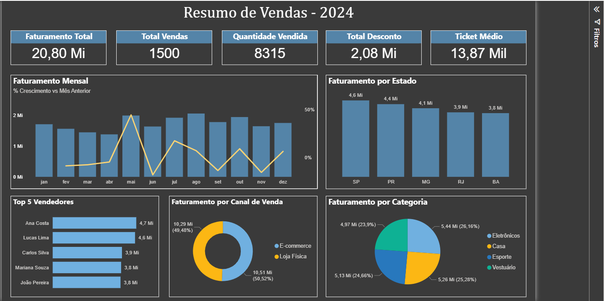

📊 Dashboard de Vendas - 2024

📌 Descrição
Este projeto apresenta um dashboard de análise de vendas desenvolvido no Power BI. O painel permite acompanhar indicadores de desempenho comercial através de visualizações interativas.

🎯 Objetivo
Demonstrar habilidades em análise de dados, modelagem e criação de dashboards no Power BI para apoiar a tomada de decisão.

⚠️ Observação
Os dados utilizados neste projeto são fictícios e foram criados apenas para fins de estudo e prática em análise de dados.

🛠️ Ferramentas Utilizadas
- Power BI
- DAX
- Excel
- Modelagem de Dados

📈 Indicadores do Dashboard
O painel apresenta os seguintes indicadores:

- Faturamento Total
- Total de Vendas
- Quantidade Vendida
- Total de Descontos
- Ticket Médio

📊 Análises Disponíveis
O dashboard permite analisar:

- Faturamento mensal
- Crescimento percentual das vendas em relação ao mês anterior
- Faturamento por estado
- Top 5 vendedores
- Faturamento por canal de venda
- Faturamento por categoria de produto

## 📷 Dashboard

## 📂 Arquivos do Projeto
- `dashboard.pbix` → Arquivo do Power BI
- `dashboard.png` → Imagem do dashboard
- `base_dados.xlsx` → Base de dados utilizada
